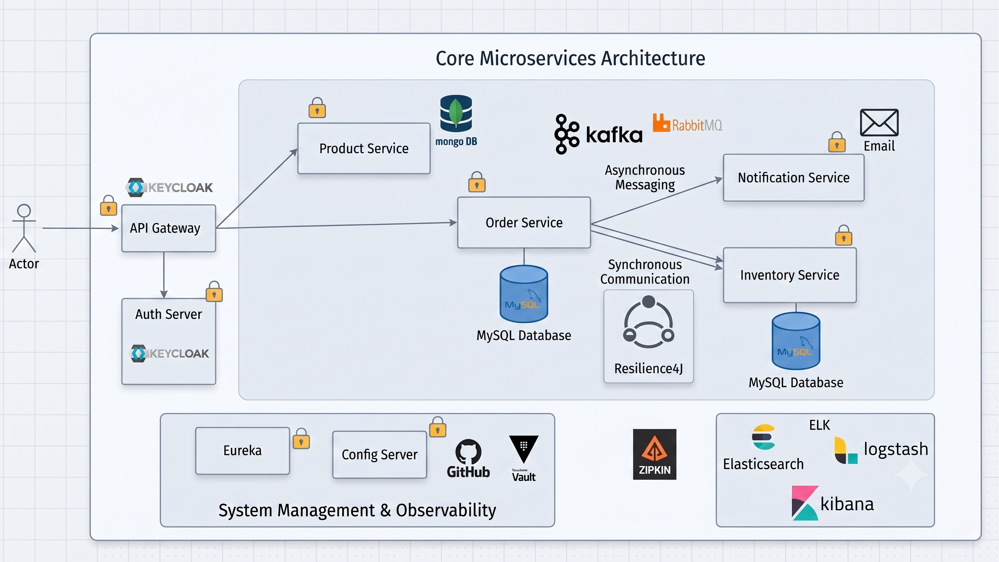

# Microservices Project

This project demonstrates a Spring Boot microservices architecture using:

- Spring Boot
- Spring Cloud
- Eureka Service Discovery
- Spring Cloud Gateway
- WebClient
- MongoDB
- KeyClock
- MySQL

## Documentation

- [Project Structure](docs/01-project-structure.md)
- [Service Communication](docs/02-service-communication.md)
- [Service Discovery & Load Balancing](docs/03-service-discovery.md)
- [API Gateway](docs/04-api-gateway.md)
- [Authentication & Authorization](docs/06-authentication%20&%20authorization.md)
- [Request Flow](docs/05-request-flow.md)
- [Circuit Breaker](docs/07-Circuit%20Breaker.md)

# Architecture

