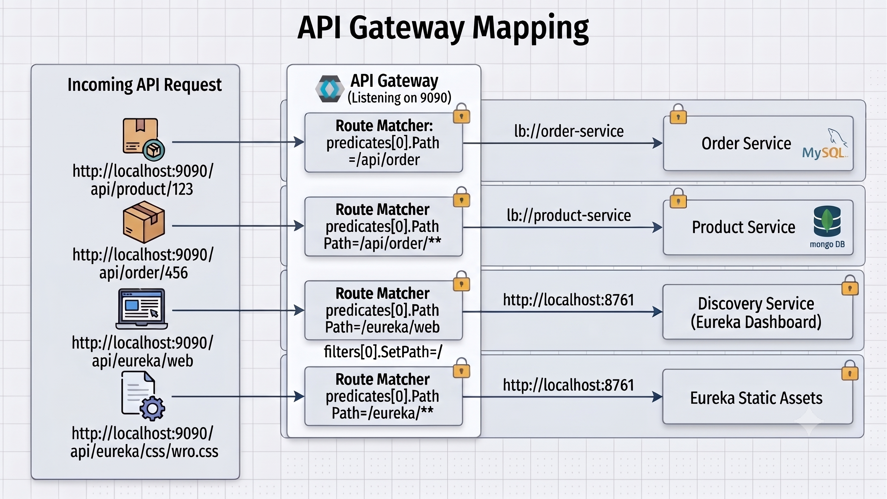

## API Gateway

To provide a single entry point for all client requests, the project uses **Spring Cloud Gateway**.

### Gateway Server

A new module named `api-gateway` was created under the `micro-parent` project.

The gateway acts as the entry point for all incoming requests and forwards them to the appropriate microservice using service discovery.

### Route Configuration

The following routes are configured in the gateway:

| Path | Destination |
|------|-------------|
| `/api/product/**` | `product-service` |
| `/api/order/**` | `order-service` |
| `/eureka/web` | Eureka Dashboard |
| `/eureka/**` | Eureka static assets (CSS, JavaScript, Icons) |

Service routes use the `lb://` prefix, allowing Spring Cloud Gateway to discover services through Eureka and automatically load balance requests across available instances.

Example:

```text
http://localhost:8080/api/order/**
                ↓
          API Gateway
                ↓
        lb://order-service
                ↓
order-service (random available port)
```

### Accessing the Eureka Dashboard

A custom route is configured for the Eureka dashboard.

The `SetPath=/` filter rewrites:

```text
http://localhost:8080/eureka/web
```

to

```text
http://localhost:8761/
```

allowing the Eureka dashboard to be accessed through the API Gateway.

An additional route is configured for `/eureka/**` so that Eureka's static resources (CSS, JavaScript, and icons) are also served correctly.

