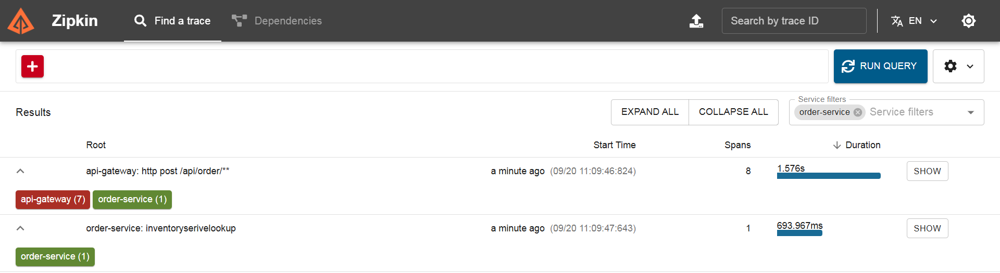

# Distributed Tracing

This feature adds **Distributed Tracing** to the microservices architecture using **Micrometer Tracing, Brave, and Zipkin**.

- **Micrometer Tracing** → Provides the tracing API/abstraction and integrates tracing capabilities with Spring Boot.
- **Brave** → Acts as the tracing implementation, creating, managing, and propagating **Trace IDs** and **Span IDs** across services.
- **Zipkin** → Collects, stores, and visualizes the trace data generated by the application.

Distributed tracing allows a single request to be tracked across multiple microservices. Each request is assigned a unique **Trace ID**, while each service involved in processing the request creates a **Span**.

This makes it easier to understand the request flow, identify slow operations, and troubleshoot issues across different services.

---

## Architecture

The request flows through multiple services as shown below (Example request flow):

```text
User
 |
 | /api/order
 v
API Gateway
 |
 | Span 1
 v
Order Service
 |
 | Span 2
 v
Inventory Service
 |
 | Span 3
```

## Zipkin

Zipkin runs as a Docker container and receives tracing data from every microservice.

For a `POST /api/order` request, the trace looks like this:

```
Trace ID: 5f3a1c9e8b2d4a71
│
├── order-service      POST /api/order         (Order Endpoint span)
│   └── inventory-service  GET /api/inventory  (Inventory Call span)
```

Key terms:

| Term         | Meaning                                                            |
|--------------|--------------------------------------------------------------------|
| **Trace**    | The full journey of one request across all services                |
| **Span**     | One unit of work inside a trace (one operation in one service)     |
| **Trace ID** | Shared by all spans of the same request, so Zipkin can group them  |
| **Span ID**  | Unique per span                                                    |
| **Parent ID**| Links a child span to the span that caused it                      |

The Trace ID is propagated between services through HTTP headers (`b3` by default with Brave, or W3C `traceparent` if configured).


## Circuit Breaker and Tracing

The Circuit Breaker is used between the Order Service and the Inventory Service. In this implementation, the Inventory Service call is executed asynchronously using `CompletableFuture`.

```text
                 Order Trace
              Trace ID: ABC123
                     |
                     v
          +----------------------+
          | Order Service        |
          |                      |
          | Order Span           |
          +----------------------+
                     |
              Circuit Breaker
                     |
              CompletableFuture
                     |
              Separate Thread
                     |
                     v
          +----------------------+
          | Inventory Service    |
          |                      |
          | Inventory Span       |
          +----------------------+
              Trace ID: XYZ789
```

Why are there two separate Trace IDs?
`CompletableFuture` executes the Inventory Service call asynchronously on a different thread.
The tracing context is associated with the execution context of the original thread. When the execution moves from the Order Service thread to the `CompletableFuture` thread, the tracing context is not automatically propagated in this implementation.
Therefore, the Inventory Service does not receive the original Trace ID and creates a new trace.

```text
Order Service Thread
        |
        | Trace ID = ABC123
        |
        | CompletableFuture
        v
CompletableFuture Thread
        |
        | Trace context not propagated
        |
        v
Inventory Service
        |
        | Trace ID = XYZ789
```

As a result, Zipkin displays two separate traces:

```text
Trace 1
ABC123
└── Order Service
    └── Order Span


Trace 2
XYZ789
└── Inventory Service
    └── Inventory Span
```

Role of the Circuit Breaker
The Circuit Breaker itself does not create a new thread. The separate thread is introduced because the service call is executed using `CompletableFuture`.
The Circuit Breaker is responsible for controlling the call based on the circuit state, such as:

* CLOSED – requests are allowed.
* OPEN – requests are prevented when the failure threshold is reached.
* HALF_OPEN – limited requests are allowed to check whether the service has recovered.

`CompletableFuture` is responsible for the asynchronous execution.
How can the two traces be connected?
To keep the same Trace ID across the `CompletableFuture` thread, the tracing context needs to be propagated from the Order Service thread to the asynchronous thread.
Micrometer Context Propagation can be used for this purpose.

```text
Order Service Thread
        |
        | Trace ID = ABC123
        |
        | Context Propagation
        v
CompletableFuture Thread
        |
        | Trace ID = ABC123
        |
        v
Inventory Service
        |
        | Inventory Span
        v
      Zipkin

```
## Custom Span Name for Trace Matching

To make the relationship between the Order Service and Inventory Service easier to identify in Zipkin, a **custom span name** can be created before the Order Service calls the Inventory Service.

The `Tracer` is used to create a new span with a meaningful name:

```java
Span inventoryLookupSpan = tracer.nextSpan()
        .name("InventoryServiceLookup")
        .start();

```
The custom span name makes the Inventory Service lookup operation easy to identify in Zipkin, even when the asynchronous CompletableFuture execution results in separate Trace IDs.

```aiignore
Order Service
     |
     | Custom Span
     | "InventoryServiceLookup"
     |
     v
CompletableFuture
     |
     v
Inventory Service
```


