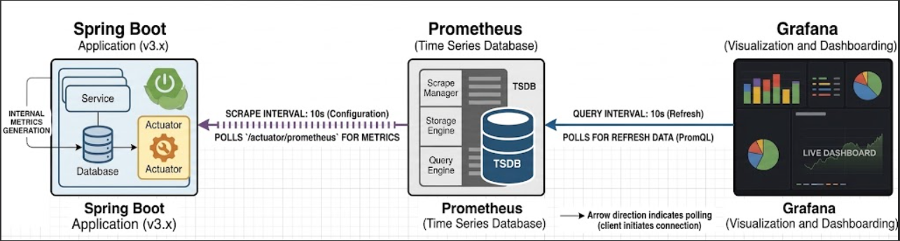
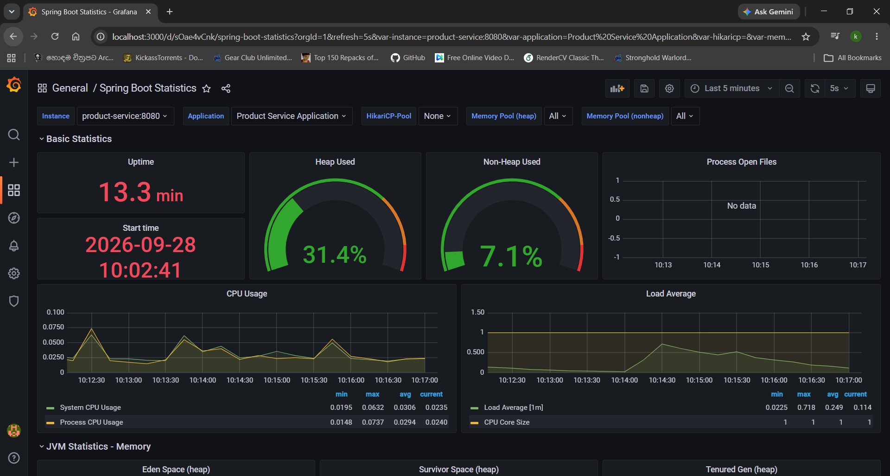

# Application Monitoring with Prometheus and Grafana

This project includes an application monitoring feature using **Spring Boot Actuator, Prometheus, and Grafana**. It collects application metrics, stores them as time-series data, and displays them through Grafana dashboards.

## Monitoring Architecture



## Features

- Application metrics collection using Spring Boot Actuator.
- Prometheus integration for time-series metrics storage.
- Metrics scraping every 10 seconds.
- Rule evaluation every 10 seconds.
- Grafana dashboards for monitoring application performance.
- PromQL-based metric queries.
- Visualization of application and system metrics.

## Technologies Used

| Technology | Purpose |
|------------|---------|
| Spring Boot | Application framework |
| Spring Boot Actuator | Exposes application metrics |
| Micrometer | Collects and exports metrics |
| Prometheus | Metrics collection and time-series database |
| Grafana | Metrics visualization and dashboards |
| PromQL | Query language for Prometheus |

## Prometheus Configuration

The Prometheus configuration is defined in `prometheus.yml`.

```yaml
global:
  scrape_interval: 10s
  evaluation_interval: 10s
```

### Scrape Interval

```yaml
scrape_interval: 10s
```

Prometheus collects metrics from the Spring Boot application every **10 seconds**.

The application exposes metrics through:

```text
/actuator/prometheus
```

### Evaluation Interval

```yaml
evaluation_interval: 10s
```

Prometheus evaluates configured recording rules and alerting rules every **10 seconds**.

This allows the monitoring system to continuously evaluate application metrics and detect conditions defined in the rules.
(Currently, there are no defined rules)


## Grafana Dashboard

Grafana is connected to Prometheus as a data source and is used to visualize
the application metrics collected by Prometheus.

A **custom Grafana dashboard** was created for this project to monitor and
visualize the application's performance and resource usage.

The dashboard is configured using a custom JSON dashboard definition, which
contains the required panels, PromQL queries, and visualization settings.

```text
grafana-dashboard.json
```

### Dashboard Metrics

The custom dashboard can be used to monitor:

- HTTP request count
- HTTP request duration
- Application performance
- JVM memory usage
- CPU usage
- Database metrics
- Custom application metrics



## Monitoring Workflow

1. The Spring Boot application generates application metrics.
2. Spring Boot Actuator exposes the metrics through `/actuator/prometheus`.
3. Prometheus scrapes the endpoint every 10 seconds.
4. Prometheus stores the collected metrics in its time-series database.
5. Prometheus evaluates configured rules every 10 seconds.
6. Grafana queries Prometheus using PromQL.
7. The collected metrics are displayed through Grafana dashboards.


## Benefits

- Continuous application monitoring.
- Regular collection of application metrics.
- Time-series data storage for analysis.
- Rule-based monitoring and alerting.
- Visual monitoring dashboards.
- Improved visibility into application performance.

## Configuration File

```text
prometheus.yml
```

Example:

```yaml
global:
  scrape_interval: 10s
  evaluation_interval: 10s

scrape_configs:
  - job_name: 'product_service'
    metrics_path: '/actuator/prometheus'
    static_configs:
      - targets: ['product-service:8080']
        labels:
          application: 'Product Service Application'
```

> **Note:** Update the target address according to your Spring Boot application's configuration.