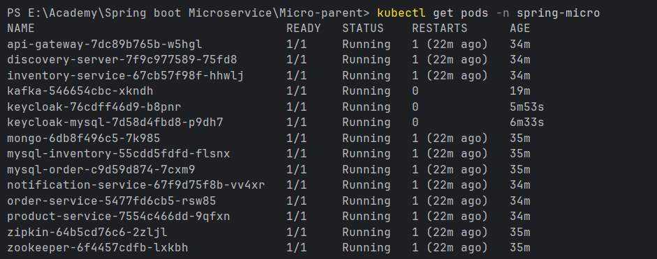

# Kubernetes Deployment

This project is also deployed using **Kubernetes** with the Kubernetes cluster provided by **Docker Desktop**.

Docker Desktop is configured with a **single-node Kubernetes cluster**. All the application and infrastructure components are deployed as Kubernetes Pods inside this single node.

## Kubernetes Architecture

The Kubernetes cluster contains the following components:

```text
Docker Desktop
│
└── Kubernetes Cluster
    │
    └── Node (docker-desktop)
        │
        ├── MySQL - Order Database
        ├── MySQL - Inventory Database
        ├── MySQL - Keycloak Database
        ├── MongoDB
        ├── Zipkin
        ├── Zookeeper
        ├── Kafka
        ├── Keycloak
        ├── Discovery Server
        ├── API Gateway
        ├── Product Service
        ├── Inventory Service
        ├── Order Service
        └── Notification Service
```

The project contains **16 Kubernetes workloads** deployed inside the single-node cluster.

## Kubernetes Namespace

A dedicated Kubernetes namespace called `spring-micro` is used to isolate the project's resources.

The namespace is created using:

```bash
kubectl apply -f k8s/namespace.yaml
```

All application and infrastructure resources are deployed into this namespace.

## Kubernetes Secrets

Sensitive configuration values are stored using Kubernetes Secrets.

```bash
kubectl apply -f k8s/secrets.yaml
```

The Secrets can then be consumed by the required Pods as environment variables or configuration values instead of hard-coding sensitive information directly into the application configuration.

## Deploying the Infrastructure

The databases and infrastructure components are deployed first.

### Order MySQL

```bash
kubectl apply -f k8s/mysql-order.yaml
```

Provides the MySQL database used by the **Order Service**.

### Inventory MySQL

```bash
kubectl apply -f k8s/mysql-inventory.yaml
```

Provides the MySQL database used by the **Inventory Service**.

### Keycloak MySQL

```bash
kubectl apply -f k8s/keycloak-mysql.yaml
```

Provides the MySQL database used by **Keycloak**.

### MongoDB

```bash
kubectl apply -f k8s/mongo.yaml
```

Deploys MongoDB for the application components that use a NoSQL database.

### Zipkin

```bash
kubectl apply -f k8s/zipkin.yaml
```

Deploys the **Zipkin server** used for distributed tracing.

### Zookeeper

```bash
kubectl apply -f k8s/zookeeper.yaml
```

Deploys **Zookeeper**, which is used by Kafka for coordination.

### Kafka

```bash
kubectl apply -f k8s/kafka.yaml
```

Deploys **Apache Kafka** for asynchronous event and message communication.

### Keycloak

```bash
kubectl apply -f k8s/keycloak.yaml
```

Deploys **Keycloak** for authentication and authorization.

## Deploying the Microservices

After the required infrastructure components are deployed, the microservices are deployed.

### Discovery Server

```bash
kubectl apply -f k8s/discovery-server.yaml
```

Deploys the service discovery server used by the microservices to discover and communicate with each other.

### API Gateway

```bash
kubectl apply -f k8s/api-gateway.yaml
```

Deploys the API Gateway, which acts as the main entry point for client requests.

### Product Service

```bash
kubectl apply -f k8s/product-service.yaml
```

Deploys the Product Service.

### Inventory Service

```bash
kubectl apply -f k8s/inventory-service.yaml
```

Deploys the Inventory Service.

### Order Service

```bash
kubectl apply -f k8s/order-service.yaml
```

Deploys the Order Service.

### Notification Service

```bash
kubectl apply -f k8s/notification-service.yaml
```

Deploys the Notification Service.

## Complete Deployment

All Kubernetes resources can be deployed using the following commands:

```bash
kubectl apply -f k8s/namespace.yaml

kubectl apply -f k8s/secrets.yaml

kubectl apply -f k8s/mysql-order.yaml
kubectl apply -f k8s/mysql-inventory.yaml
kubectl apply -f k8s/keycloak-mysql.yaml
kubectl apply -f k8s/mongo.yaml

kubectl apply -f k8s/zipkin.yaml
kubectl apply -f k8s/zookeeper.yaml
kubectl apply -f k8s/kafka.yaml
kubectl apply -f k8s/keycloak.yaml

kubectl apply -f k8s/discovery-server.yaml
kubectl apply -f k8s/api-gateway.yaml

kubectl apply -f k8s/product-service.yaml
kubectl apply -f k8s/inventory-service.yaml
kubectl apply -f k8s/order-service.yaml
kubectl apply -f k8s/notification-service.yaml
```

## Check Pod Status

After deploying the resources, the status of the Pods can be checked using:

```bash
kubectl get pods -n spring-micro
```

This displays information such as:



The main columns are:

| Column     | Description                                   |
| ---------- | --------------------------------------------- |
| `NAME`     | Name of the Pod                               |
| `READY`    | Number of containers ready / total containers |
| `STATUS`   | Current state of the Pod                      |
| `RESTARTS` | Number of container restarts                  |
| `AGE`      | Time since the Pod was created                |

For example:

```text
1/1   Running
```

means the Pod has one container and that container is ready.


## Port Forwarding

Because this is a local Kubernetes cluster, `kubectl port-forward` is used to forward traffic from the local machine to Kubernetes Services.

### API Gateway

The API Gateway Service listens on port `9090` inside Kubernetes.

Port `8181` on the local machine is forwarded to port `9090` of the API Gateway Service:

```bash
kubectl port-forward -n spring-micro svc/api-gateway 8181:9090
```

The traffic flow is:

```text
Local Machine
     │
     │ http://localhost:8181
     ▼
kubectl port-forward
     │
     │ port 9090
     ▼
API Gateway Service
     │
     ▼
API Gateway Pod
```

The API Gateway can then be accessed through:

```text
http://localhost:8181
```

### Keycloak

Keycloak runs on port `8080`.

The following command forwards local port `8080` to the Keycloak Service:

```bash
kubectl port-forward -n spring-micro svc/keycloak 8080:8080
```

The traffic flow is:

```text
Local Machine
     │
     │ http://localhost:8080
     ▼
kubectl port-forward
     │
     │ port 8080
     ▼
Keycloak Service
     │
     ▼
Keycloak Pod
```

Keycloak can then be accessed through:

```text
http://localhost:8080
```

### Running Both Port Forwards

Each `kubectl port-forward` command remains active while the forwarding session is running.

Therefore, run the commands in separate terminals:

**Terminal 1:**

```bash
kubectl port-forward -n spring-micro svc/api-gateway 8181:9090
```

**Terminal 2:**

```bash
kubectl port-forward -n spring-micro svc/keycloak 8080:8080
```

The port-forwarding sessions can be stopped with:

```text
Ctrl + C
```

## Inspect a Pod

To get detailed information about a specific Pod:

```bash
kubectl describe pod <pod-name> -n spring-micro
```

For example:

```bash
kubectl describe pod keycloak -n spring-micro
```

This can be useful for troubleshooting Pod scheduling, container startup, configuration, events, and networking issues.

## View Pod Logs

Application logs can be viewed using:

```bash
kubectl logs <pod-name> -n spring-micro
```

For example:

```bash
kubectl logs keycloak -n spring-micro
```

Logs are useful for troubleshooting application startup problems, database connection errors, Kafka connection problems, and other runtime issues.

## Kubernetes Architecture Overview

The complete local deployment can be represented as:

```text
                         Docker Desktop
                              │
                              ▼
                  ┌────────────────────────┐
                  │ Kubernetes Cluster     │
                  │                        │
                  │    Single Node         │
                  │    docker-desktop      │
                  │                        │
                  │ ┌────────────────────┐ │
                  │ │ Infrastructure     │ │
                  │ │                    │ │
                  │ │ MySQL              │ │
                  │ │ MongoDB            │ │
                  │ │ Kafka              │ │
                  │ │ Zookeeper          │ │
                  │ │ Keycloak           │ │
                  │ │ Zipkin             │ │
                  │ └────────────────────┘ │
                  │                        │
                  │ ┌────────────────────┐ │
                  │ │ Microservices      │ │
                  │ │                    │ │
                  │ │ Discovery Server   │ │
                  │ │ API Gateway        │ │
                  │ │ Product Service    │ │
                  │ │ Inventory Service  │ │
                  │ │ Order Service      │ │
                  │ │ Notification       │ │
                  │ └────────────────────┘ │
                  └────────────────────────┘
                              │
                    kubectl port-forward
                         │          │
                         ▼          ▼
                  localhost:8181  localhost:8080
                         │          │
                         ▼          ▼
                    API Gateway   Keycloak
```

This Kubernetes setup provides a local environment for deploying, running, monitoring, and testing the complete microservices architecture using **Docker Desktop Kubernetes**.